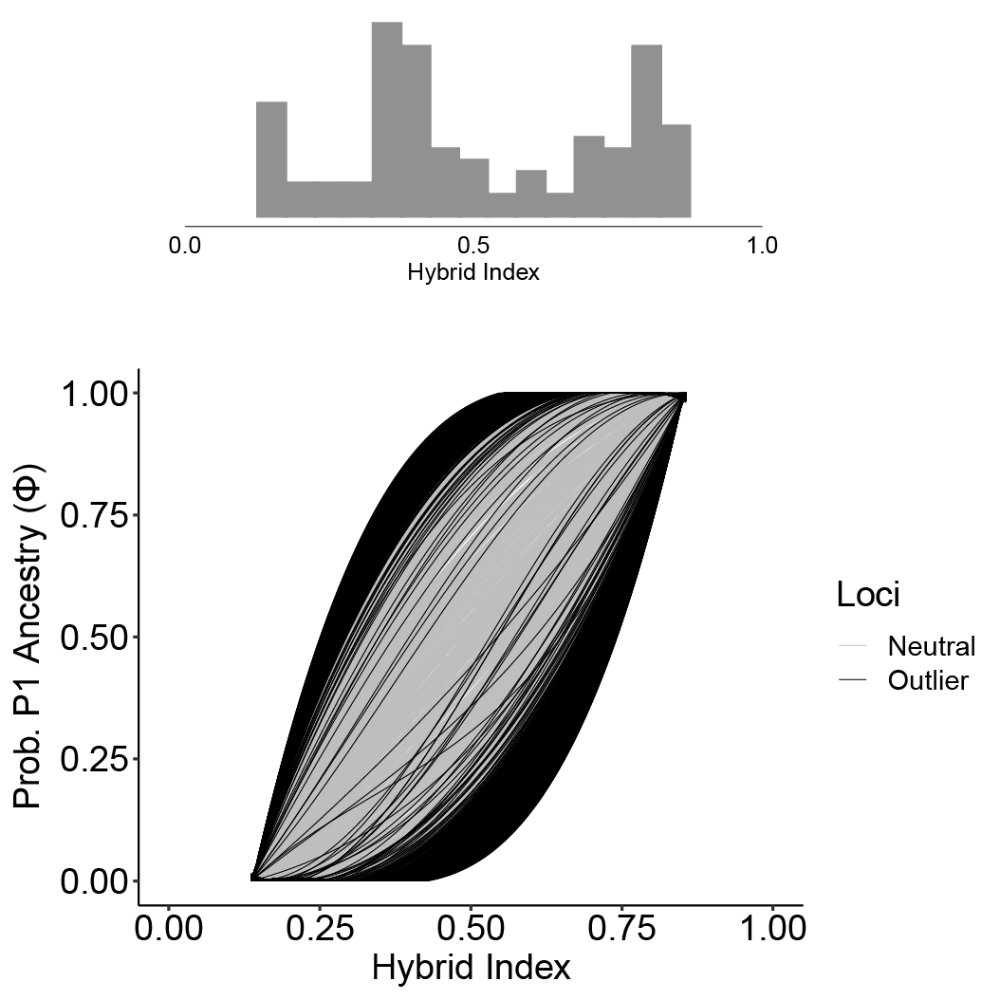

# bgcPlotter
Plot BGC genomic cline results

bgcPlotter allows you to plot BGC (Bayesian Genomic Cline) output. After we ran BGC, we realized it wasn't easy to plot the BGC results, so we put together this package in the process of figuring it out.

The package allows you to make several plots.

## Phi ~ Hybrid Index Plots

First, the Phi plot that Gompert et al. made in some of their papers. In this plot, Phi is the Probability of P1 ancestry, and the Probability of P0 ancestry is 1 - Phi. Phi is plotted on the Y-axis and hybrid index on the X-axis.

Here is an example of a Phi plot that bgcPlotter can make:

![Phi Plot: Alpha Outliers.]

In the above plot, significant BGC alpha outlier clines are highlighted in black, and the non-significant loci are gray. A hybrid index histogram is included above the Phi plot. A separate plot is automatically made to highlight beta outliers. Many aspects of the plot can be adjusted with arguments to suit your needs, including colors, width/height, margins, criteria for determining outliers, and many more.

With BGC, positive alpha outliers indicate excess P1 ancestry compared to the genome-wide average. Negative indicate excess P0 ancestry.

Positive beta outliers indicate a steeper cline (i.e. a faster rate of transition and selection against introgression), whereas negative beta indicates hybrid vigor (i.e. higher introgression than expected).

## Chromosome Plots

If you have appropriate data and follow some steps beforehand, our package will also let you plot the alpha and beta outliers on a karyotype, like here:


For each chromosome, alpha outliers are plotted on the left and beta are on the right. The larger bands represent outliers that fell in known mRNA loci, whereas the thinner bands are from unknown scaffolds. This way, you can visualize the outliers on actual chromosomes.

Here few things you need to have to make the ideogram:

* You need an appropriately close reference genome 
  + Fully assembled at the chromosome level

* You need a reference transcriptome
* At least scaffold-level assembly for your study species
* A GFF file
* The transcript and scaffold IDs have to line up wiht the BGC loci

If you don't have all those things, you can still make the Phi plots.


## Dependencies

bgcPlotter has several dependencies:

* data.table
* dplyr
* bayestestR
* scales
* reshape2
* ggplot2
* forcats
* gtools
* RIdeogram
* gdata

## Installing the Package

To install bgcPlotter, you can do the following:

```
# If you don't already have devtools installed
install.packages("devtools")

devtools::install_github("btmartin721/bgcPlotter")
``` 

Now load the library.
```
library("bgcPlotter")
```

## Aggregate BGC Runs

If you ran multiple BGC runs, bgcPlotter allows you to aggregate them together to increase your MCMC sampling. Log-likelihood MCMC traces can be made with the plot_lnl() function to assess convergence. This is **strongly** recommended if aggregating BGC runs. You should make sure all five runs have converged (see lnl_plot below).

To aggregate the BGC runs, you first need the BGC output in the correct format.


You should have the following files to run this package:

### Loci File

This file is a two-column whitespace-separated file with locus ID as column 1 and SNP position as column 2.

Here is an example what this should look like:

```
#CHROM POS
XM_024192520.2 851
XM_024192520.2 854
XM_024192520.2 859
```

Each line is one locus.

The first column indicates transcript or scaffold ID. The second indicates the SNP position on the scaffold or mRNA. 

If you don't want to make the ideogram, these values can be anything without whitespace.

### BGC Output Files

* prefix_bgc_stat_a0_runNumber
* prefix_bgc_stat_b0_runNumber
* prefix_bgc_stat_qa_runNumber
* prefix_bgc_stat_qb_runNumber
* prefix_bgc_stat_hi_runNumber
* prefix_bgc_stat_LnL_runNumber
  
E.g., population1_bgc_stat_a0_1

These suffixes are required for the input files.

The bgc_stat files can be generated with the estpost software included with BGC. estpost can create these files from the HDF5 file that BGC writes to.

The qa and qb files are generated by using the gamma-quantile and zeta-quantile options with the -p parameter.

When using estpost, don't include header lines, and output them to ascii format.

I.e., use the following options:

```
-s 2 -w 0
```

This will format them correctly for bgcPlotter.

Once you have the output files, you can run combine_bgc_output()

```{r combine_bgc_runs}

prefix <- "population1"

bgc.genes <-
  combine_bgc_output(results.dir = "exampledata/genes/",
                     prefix = prefix)
```

This is with the default options.

If you determine that you want to thin the MCMC samples, you can use the thin parameter:

```
bgc.genes <-
  combine_bgc_output(results.dir = "exampledata/",
                     prefix = "population1", 
                     thin = 2)
```

This will thin it to every 2nd sample. Keep in mind that this is thinning the MCMC **samples**, not all the iterations. So if you had a total of 200,000 post-burnin iterations X 5 runs (i.e. 1,000,000 total iterations), and you told BGC to sample every 40 generations, you would end up with 5000 X 5 = 25,000 MCMC samples.

If you then used combine_bgc_output to thin every 2nd iteration, it would retain 12,500 MCMC samples.

One reason to use this is if you have a ton of loci and you want to reduce the computational burden.

Another available option is to discard the first N MCMC samples.

```
bgc.genes <-
  combine_bgc_output(results.dir = "exampledata/",
                     prefix = "population1",
                     discard = 2500)
```

This will discard the first 2500 samples from **each run**. So if like in the example before you had 25,000 MCMC samples, and you discarded 2500, you would end up with 12,500 MCMC samples. The difference here is that instead of taking every Nth sample, you are taking the last N samples of each run.

One reason to use this is if you notice that the runs converged e.g. 2500 samples post-burnin. In this case you could just discard the non-converged portions of the runs.

## Plot Log-likelihood Traces

It is **strongly** recommended to inspect the LnL traces if you are aggregating the runs. You can do this with the plot_lnl() function.

```
plot_lnl(df.list = bgc.genes,
         prefix = prefix,
         thin = 40,
         plotDIR = "./plots")
```

This function uses the object created with combine_bgc_output().

The thinning parameter is what you used with BGC, and the plot will be saved in plotDIR.

Here are some examples that plot_lnl makes:


Here we aggregated five BGC runs with 2,000 samples each. You can see that all five converged.

Here's an example of LnL that didn't converge among the five runs:


You can tell the five runs started to converge towards the end, but the LnL were still rising until close to the end of the run. This one needed to be re-run with longer burn-in.

## Identify Outlier Loci

Here we identify alpha and beta outliers using the get_bgc_outliers() function.

For this you need a population map file. It should be a two-column, tab-separated file with individual IDs as column 1 and population ID as column 2. No header.

E.g., 

```
ind1 population1
ind2 population1
ind3 population2
ind4 population2
```

```{r get_bgc_outliers}
gene.outliers <-
  get_bgc_outliers(
    df.list = bgc.genes,
    admix.pop = "population1",
    popmap = "exampledata/popmap.txt",
    loci.file = "exampledata/genes/population1_bgc_loci.txt",
    qn = 0.975)
```

get_bgc_outliers records outliers in three ways.

1. If the credible interval for alpha or beta do not overlap zero.

2. If alpha or beta falls outside the quantile interval: qn / 2 and (1 - qn) / 2. This one is more conservative.

3. If both are TRUE. This is the most conservative one.

qn can be adjusted. The default is 0.975 as the upper interval bound. If you set the qn parameter to 0.95, the interval will be 0.95 / 2 and (1 - 0.95) / 2.

The object returned from this can be input directly into phiPlot(). 

You can save this function's output as an RDS object for later use by setting save.obj = TRUE

## Make the Phi Plot

Now you can make the Phi plot. The popname can be any string you want here.

```
phiPlot(outlier.list = gene.outliers,
        popname = paste0("Pop 1", " Genes"),
        line.size = 0.25,
        saveToFile = paste0(prefix, "_genes"),
        plotDIR = "./plots/",
        hist.y.origin = 1.2,
        hist.height = 1.8,
        margins = c(160.0, 5.5, 5.5, 5.5),
        hist.binwidth = 0.05)
```

If you want to save the plot to a file, just use the saveToFile option. If specified, it should be the filename you want to save to. If you don't use this option, it will appear in your Rstudio plot window.

Most of the plot settings can be adjusted. See ?phiPlot for more info.

You can change the criteria for identifying outlier loci with the overlap.zero, qn.interval, and both.outlier.tests options. By default, it is set to identify outliers using either overlap.zero and qn.interval. I.e. it only has to meet at least one of the criteria. You can turn one or the other off if you want by setting e.g. overlap.zero = FALSE. They can't both be off unless both.outlier.tests = TRUE.

If you set both.outlier.tests to TRUE, it will require that outliers meet both criteria. This overrides overlap.zero and qn.interval settings.

E.g.,


This is a more conservative outlier test. There will be fewer outliers with both required.

## Chromosome Plots

**Important:** If you want to make the ideogram plots, you will need to run the previous steps for just SNPs aligned to your study organism's transcriptome AND for all genome-wide loci. The transcriptome loci names should have the GenBank Transcript IDs (like found in a GFF file), and the genome-wide loci should have scaffold IDs as the loci names.

For this part, you need a closely related reference genome that is assembled at the chromosome level. Second, your model organisms needs to have at least a scaffold-level genome and a transcriptome. You will also need a GFF file for the annotations.

If you don't have all of those, you won't be able to do the chromosome plot.

If you do, you need to run some a priori analyses first.

### Align scaffold-level Assembly to a Reference Genome.

You need to use minimap2 for this part. https://github.com/lh3/minimap2

1. To map the assembly data to the reference genome, name the reference chromosomes in a fasta file something like "chr1", "chr2", etc. The important thing is that they have a string prefix and an integer at the end. This will be important downstream.

2. Remove unplaced scaffolds from the reference genome's fasta file.

3. Combine the genome-wide and transcriptome fasta files into one file.

4. Run minimap2. Tested with minimap2 v2.17.
  + Example command: 
  + ```minimap2 --cs -t 4 -x asm20 -N 100 ref.fasta assembly.fasta > refmap_asm20.paf```
  
5. You will want to adjust asm20 to suit how closely related your reference genome is to your study organism. asm 20 is suitable if the average sequence divergence is ~10%, and it allows up to 20% divergence. asm10 is suitable for 5% average, up to 10%. asm5 is for divergence of a few percent and up to 5%.

You also will want to save the output as a paf file (default in minimap2).

6. Next, run PAFScaff. https://github.com/slimsuite/pafscaff
  + PAFScaff cleans up and improves the mapping.
  + Some of the output files from PAFScaff will be required to make the chromosome plot.
  + **Important**: When running PAFScaff, set refprefix=ref_chromosome_prefix, newprefix=query, and unplaced=unplaced_ and sorted=RefStart
  
  + Once PAFScaff is done running, you can move on with the chromosome plots.
  
### Make Chromosome Plots

These steps assume you have run combine_bgc_output() and get_bgc_outliers() for both transcriptome loci and genome-wide loci. 

```
prefix2 <- "full_population1"

# Aggregate the runs
bgc.full <-
  combine_bgc_output(results.dir = "exampledata/fulldataset",
                     prefix = "full_population1")

# Find the outliers
full.outliers <-
  get_bgc_outliers(
    df.list = bgc.full,
    admix.pop = "population1",
    popmap = file.path("./exampledata/popmap.txt"),
    loci.file = file.path("./exampledata/fulldataset/",
                          paste0(prefix2, "_bgc_loci.txt"))
  )
```


Read in the GFF file using the parseGFF function.

```
gff <- parseGFF(gff.filepath = "./exampledata/genes.gff")
```

Now join the GFF annotations with the transcriptome dataset.

```{r join_bgc_gff}
genes.annotated <-
  join_bgc_gff(prefix = prefix,
               outlier.list = gene.outliers,
               gff.data = gff,
               scafInfoDIR = "./scaffold_info")
```

The scafInfoDIR parameter allows you to save the annotated output (e.g. with gene names) to this directory.

### Plot It

To plot, you need the genome-wide outliers, the annotated transcriptome data, and the *.scaffolds.tdt output from PAFScaff.

If some chromosomes didn't have any outliers on them, they might not get plotted. If that's the case, you can use the missing.chrs and miss.chr.length arguments to include them. You just need their names in a vector and a vector of each chromosome's length (in base pairs).


```
plot_outlier_ideogram(
  prefix = prefix,
  outliers.genes = genes.annotated,
  outliers.full.scaffolds = full.outliers,
  pafInfo = "exampledata/refmap_asm20.scaffolds.tdt",
  plotDIR = "./plots",
  missing.chrs = c("chr11", "chr21", "chr25"),
  miss.chr.length = c(4997863, 1374423, 1060959)
)
```


This plot gets saved as an SVG file in plotDIR and by default a PDF file (in the current working directory). But you can change the PDF output to PNG or JPG if you want. See ?plot_outlier_ideogram


