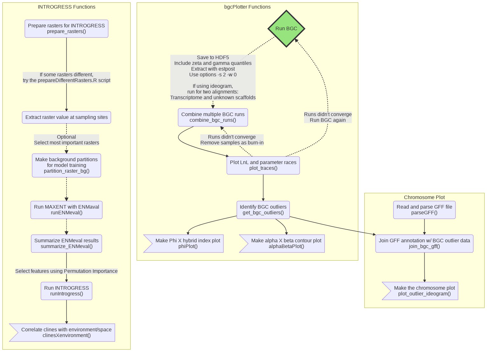
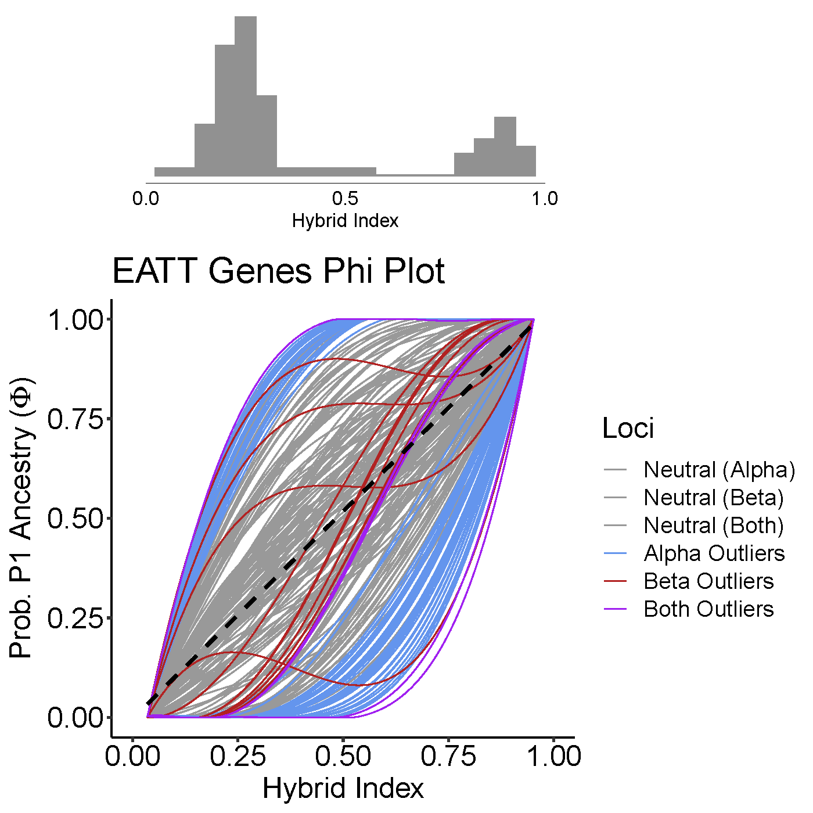
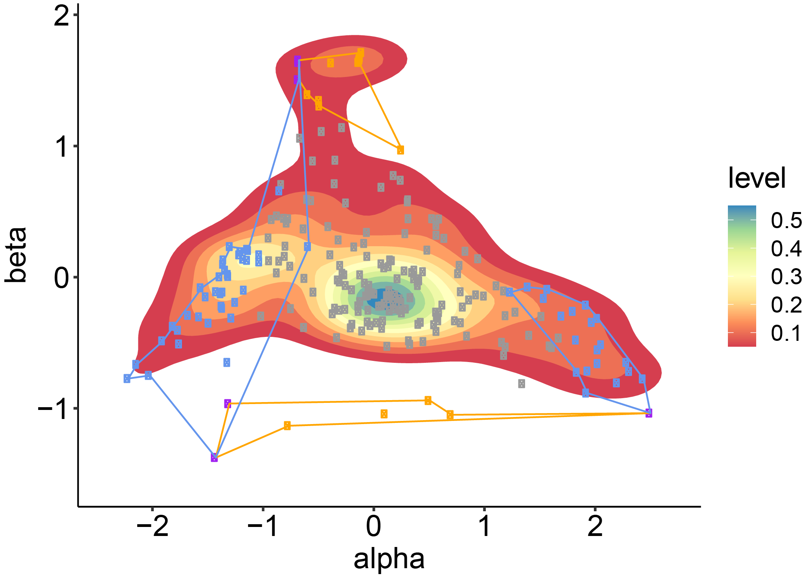
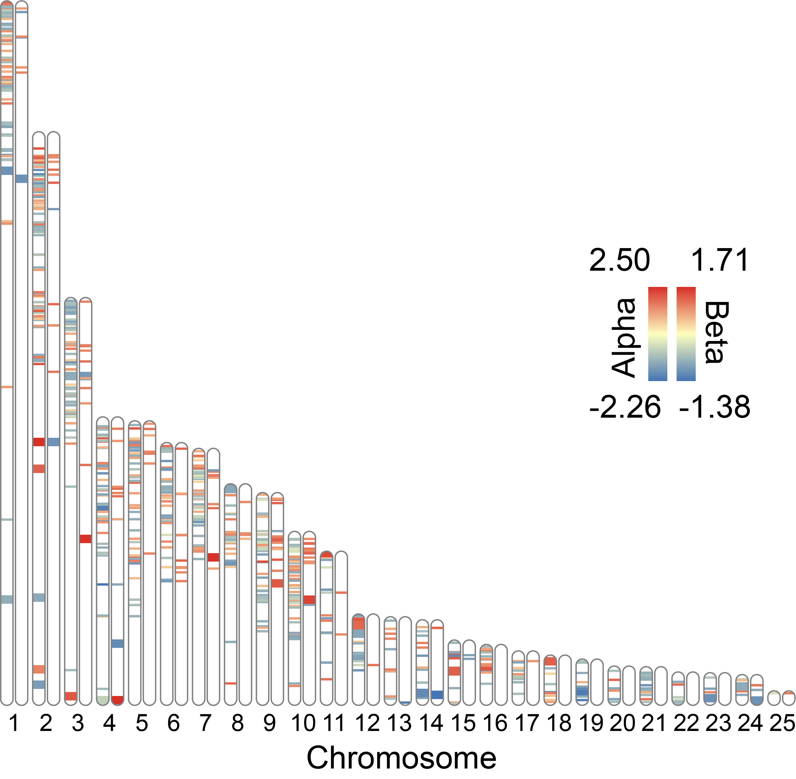
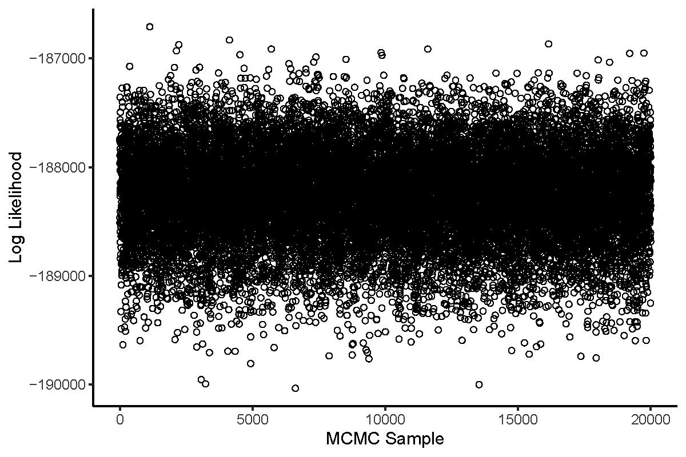
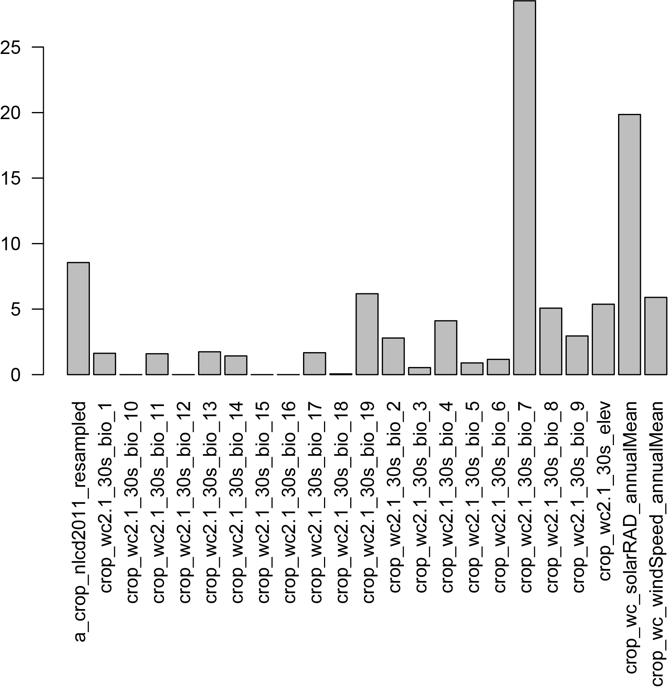
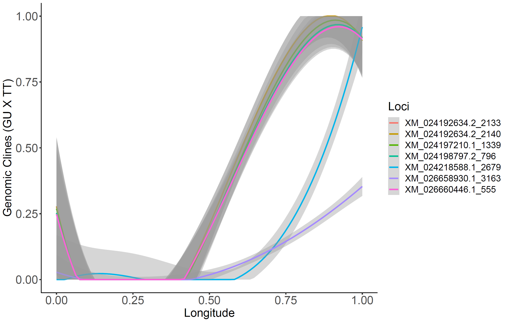
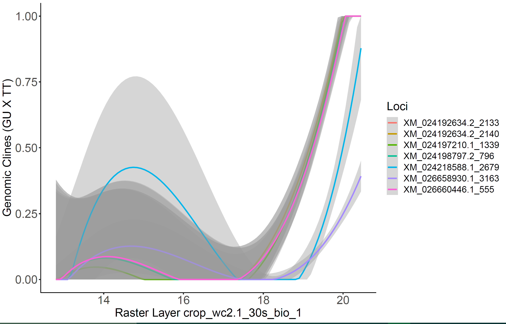
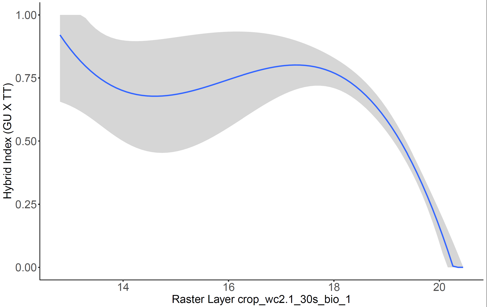

# ClineHelpR

Plot BGC and INTROGRESS genomic cline results and correlate INTROGRESS clines with environmental variables.  


ClineHelpR allows you to plot BGC (Bayesian Genomic Cline) output. After we ran BGC, we realized it wasn't easy to plot the BGC results, so we put together this package in the process of figuring it out. 

Our package allows you to make several plots.

The BGC and INTROGRESS software packages are described elsewhere (Gompert and Buerkle, 2010, 2011, 2012; Gompert et al., 2012a, 2012b).  


## Software Flow Diagram

  


## Example Dataset
All example data are available from a Dryad Digital Repository (https://doi.org/10.5061/dryad.b2rbnzsc8), as the files are too large for GitHub. To run the example data, download the exampleData directory from DRYAD, then run the R scripts in the ClineHelpR/scripts directory.

## Dependencies

ClineHelpR has several dependencies. 

The bgcPlotter functions require:

* data.table
* dplyr
* bayestestR
* scales
* reshape2
* ggplot2
* forcats
* gtools
* RIdeogram
* gdata
* adegenet

The environmental functions require:

* ENMeval
* rJava
* raster
* sp
* dismo

The INTROGRESS functions require:  
* introgress
* ggplot2
* dplyr
* scales

## Installing the Dependencies  

Most of the dependencies can be installed with Anaconda3. The only one that cannot be installed via conda is the 
Introgress R package. Below is a conda command that can be used to install all the other dependencies:

```
conda install -c conda-forge r-base r-dplyr r-bayestestr r-scales r-reshape2 r-ggplot2 r-forcats r-gtools r-rideogram r-gdata r-adegenet r-enmeval r-rjava r-raster r-sp r-dismo r-devtools
```

## Installing the Package

To install ClineHelpR, you can do the following:

```
# If you don't already have devtools installed
install.packages("devtools")

devtools::install_github("btmartin721/ClineHelpR")
``` 

Now load the library.  
```
library("ClineHelpR")
```

## bgcPlotter

The BGC functions allow you to:  
1. Plot genomic clines as Phi (Prob. P1 ancestry) on the Y-axis and hybrid index on the X-axis.  
2. Plot a chromosomal ideogram with BGC outliers shown on chromosomes.    

The workflow for plotting BGC results is described below.  

### Phi ~ Hybrid Index Plots  

First, the Phi plot that Gompert et al. made in some of their papers. In this plot, Phi is the Probability of P1 ancestry, and the Probability of P0 ancestry is 1 - Phi. Phi is plotted on the Y-axis and hybrid index on the X-axis.  

Here is an example of a Phi plot that ClineHelpR can make (*sensu* Gompert et al., 2012b):  

  

In the above plot, significant BGC alpha outlier clines are highlighted in blue, significant beta outliers are in red, and loci that are outliers in both alpha and beta are purple. The non-significant loci are gray. A hybrid index histogram is included above the Phi plot. Many aspects of the plot can be adjusted with arguments to suit your needs, including colors, width/height, margins, criteria for determining outliers, and many more.  

With BGC, positive alpha outliers indicate excess P1 ancestry compared to the genome-wide average. Negative indicate excess P0 ancestry.  

Positive beta outliers indicate a steeper cline (i.e. a faster rate of transition and selection against introgression), whereas negative beta indicates hybrid vigor (i.e. higher introgression than expected).  

### Alpha X Beta Contour Plots

You can also create a contour plot with alpha on the x-axis and beta on the y-axis. The function will also create polygon hulls around the outliers to encapsulate 2-D outlier space (*sensu* Gauthier et al., 2020).



### Chromosome Plots  

If you have appropriate data and follow some external steps beforehand, our package will also let you plot the alpha and beta outliers on a karyotype (*sensu* Martin et al., 2020):  

  

Each chromosome is duplicated with alpha outliers (left) and beta outliers (right) plotted as heatmaps. The larger bands represent outliers that fell in known mRNA loci, whereas the thinner bands are from unknown scaffolds. This way, you can visualize the outliers on actual chromosomes. ClineHelpR uses the [RIdeogram](https://cran.r-project.org/web/packages/RIdeogram/index.html) R-package (Hao et al., 2020) to make these plots.

Here few things you need to have to make the ideogram:  

* You need to run BGC twice
  + Once with transcriptome-aligned SNPs
  + Another time for unplaced scaffolds.  

* You need an appropriately close reference genome   
  + Fully assembled at the chromosome level  

* You need a reference transcriptome  
* At least scaffold-level assembly for your study species  
* A GFF file  
* The transcript and scaffold IDs have to line up with the BGC loci  

If you don't have all those things, you can still make the Phi plots and alphabeta contour plots.   

You should have the following files to run this package:  

### Necessary Phi Input Files 

#### BGC Output Files  

  + prefix_bgc_stat_a0_runNumber
  + prefix_bgc_stat_b0_runNumber
  + prefix_bgc_stat_qa_runNumber
  + prefix_bgc_stat_qb_runNumber
  + prefix_bgc_stat_hi_runNumber
  + prefix_bgc_stat_LnL_runNumber
  
E.g., population1_bgc_stat_a0_1  

These suffixes are required for the input files.  

The bgc_stat files can be generated with the estpost software included with BGC. estpost creates these files from the HDF5 file that BGC writes to.  

The qa and qb files are generated by using the gamma-quantile and zeta-quantile options with the -p parameter.  

When using estpost, don't include header lines, and output them to ascii format.  

I.e., use the following options:  

```-s 2 -w 0```  

This will format them correctly for ClineHelpR.  

Make sure you tell BGC to output the zeta and gamma quantile estimates into the HDF5 file.  

#### Population Map File

It should be a two-column, tab-separated file with individual IDs as column 1 and population ID as column 2. No header.

E.g., 

```
ind1 population1
ind2 population1
ind3 population2
ind4 population2
```

#### Loci File

This file is a two-column whitespace-separated file with locus ID as column 1 and SNP position as column 2.  

Here is an example what it should look like: 

```
#CHROM POS
XM_024192520.2 851
XM_024192520.2 854
XM_024192520.2 859
```

Each line is one locus.  

The first column indicates transcript or scaffold ID. The second indicates the SNP position on the scaffold or mRNA. So you need physical scaffold coordinates for the unplaced scaffolds, and transcriptome coordinates for the transcriptome-aligned dataset.

If you don't have this information, ClineHelpR will detect that you don't and create a spoof one automatically. It isn't used by the phiPlot and alphaBetaPlot functions, so it won't affect those. You just won't be able to make the chromosome plots if you don't have locus information.  

### Make Phi Plots

These functions all use the example data from the DRYAD repository (see above).

#### Aggregate BGC Runs

ClineHelpR allows you to aggregate multiple BGC runs together to increase your MCMC sampling. Log-likelihood MCMC traces can be made with the plot_traces() function to assess convergence. This is **strongly** recommended if aggregating BGC runs. You should make sure all five runs have converged (see the LnL and parameter traces below).

To aggregate the BGC runs, you first need the BGC output in the correct format.

First, you need to run combine_bgc_output()

```
bgc.genes <-
  combine_bgc_output(results.dir = "exampleData/bgc/bgc_outputFiles/genes",
                     prefix = "eatt")
```  

This is with the default options.  

If you determine that you want to thin the MCMC samples, you can use the thin parameter:

```
bgc.genes <-
  combine_bgc_output(results.dir = "exampleData/bgc/bgc_outputFiles/genes",
                     prefix = "eatt", 
                     thin = 2)
```

This will thin it to every 2nd sample. Keep in mind that this is thinning the MCMC **samples**, not all the iterations. So if you had a total of 200,000 post-burnin iterations X 5 runs (i.e. 1,000,000 total iterations), and you told BGC to sample every 40 generations, you would end up with 5000 X 5 = 25,000 MCMC samples.

If you then used combine_bgc_output to thin every 2nd iteration, it would retain 12,500 MCMC samples.

One reason to use this is if you have a ton of loci and you want to reduce the computational burden.

Another available option is to discard the first N MCMC samples as burn-in:

```
bgc.genes <-
  combine_bgc_output(results.dir = "exampleData/bgc/bgc_outputFiles/genes",
                     prefix = "eatt",
                     discard = 2500)
```

This will discard the first 2500 samples from **each run**. So if like in the previous example you had 25,000 MCMC samples, and you discarded 2500 from each of the five runs, you would end up with 12,500 MCMC samples. The difference here is that instead of taking every Nth sample, you are discarding the first N samples of each run.

One reason to use this is if you notice that the runs converged e.g. 2500 samples post-burnin. In this case you could just discard the non-converged portions of the runs as burn-in.

#### Plot BGC Parameter Traces

It is **strongly** recommended to inspect the traces if you are aggregating the runs. You can do this with the plot_traces() function.

```
plot_traces(df.list = bgc.genes,
         prefix = "eatt",
         plotDIR = "exampleData/bgc/bgcPlotter_output")
```

This function uses the object created with combine_bgc_output() above.

The plots will be saved in plotDIR.

Here are some examples that plot_traces() makes:

  


Here we aggregated five BGC runs with 2,000 samples each. You can see that all five converged.

Here's an example of LnL that didn't converge among the five runs:


You can tell the five runs started to converge towards the end, but the LnL were still rising until close to the end of the run. This one needed to be re-run in BGC with longer burn-in.

#### Identify Outlier Loci

Here we identify alpha and beta outliers using the get_bgc_outliers() function.

For this you need a population map file (see above for the format).

```
gene.outliers <-
  get_bgc_outliers(
    df.list = bgc.genes,
    admix.pop = "EATT",
    popmap = "exampleData/bgc/bgc_lociFiles/eatt.bgc.popmap_final.txt",
    loci.file = "exampledata/genes/eatt_bgc_loci.txt",
    qn = 0.975)
```

get_bgc_outliers records outliers in three ways.

1. If the credible interval for alpha or beta do not overlap zero.

2. If alpha or beta falls outside the quantile interval: qn / 2 and (1 - qn) / 2. This one is more conservative.

3. If both 1. and 2. are TRUE. This is the most conservative one.  

qn can be adjusted. The default is 0.975 as the upper interval bound. If you set the qn parameter to 0.95, the interval will be 0.95 / 2 and (1 - 0.95) / 2.

The object returned from this can be input directly into phiPlot(). 

You can save this function's output as an RDS object for later use by setting save.obj = TRUE

#### Plot Genomic Clines

Now you can make the Phi genomic cline plot. The popname argument can be any string you want here.

```
phiPlot(outlier.list = gene.outliers,
        popname = paste0("EATT", " Genes"),
        line.size = 0.25,
        saveToFile = paste0(prefix, "_genes"),
        plotDIR = "exampleData/bgc/bgcPlotter_output",
        hist.y.origin = 1.2,
        hist.height = 1.8,
        margins = c(160.0, 5.5, 5.5, 5.5),
        hist.binwidth = 0.05)
```

  


If you want to save the plot to a file, just use the saveToFile option. If specified, the value should be the filename you want to save to. If you don't use this option, it will appear in your Rstudio plot window.

Most of the plot settings can be adjusted as needed. See ?phiPlot for more info.

You can change the criteria for identifying outlier loci with the overlap.zero, qn.interval, and both.outlier.tests options. By default, it is set to identify outliers using either overlap.zero or qn.interval. I.e., it only has to meet at least one of the criteria. You can turn one or the other off if you want by setting overlap.zero = FALSE or qn.interval = FALSE. They can't both be off unless both.outlier.tests = TRUE.

If you set both.outlier.tests to TRUE, it will require that outliers meet both criteria. This overrides overlap.zero and qn.interval settings and is a more conservative outlier test. There will be fewer outliers with both required.  

### Make Alpha X Beta Contour Plots

Using the output from above, you can also create the Alpha X Beta contour plot. The plot will have polygon hulls around the outlier space. You might need to adjust the padding.   

```
# alphabetaplot
# 2-D contour plot with hulls for outliers
alphaBetaPlot(
  gene.outliers,
  alpha.color = "cornflowerblue",
  beta.color = "orange",
  neutral.color = "gray60",
  saveToFile = "eatt",
  plotDIR = "exampleData/bgc/bgcPlotter_output",
  padding = 0.2,
)
```  

As with the phiPlot function, either or both of the outlier tests can be used to classify outliers. Many of the plot features are also customizable, such as margins, colors, etc.  

If the contours go off the plot space, adjust the padding parameter.


### Chromosome Plots

**Important:** If you want to make the ideogram plots, you will need to run BGC and the previous R functions twice: Once for SNPs aligned only to your study organism's transcriptome, and a second time for all genome-wide loci (i.e. unplaced scaffolds). The transcriptome loci names should have the GenBank Transcript IDs (as found in the GFF file), and the scaffold-aligned loci should have scaffold IDs as the locus names.

For this part, you need a closely related reference genome that is assembled at the chromosome-level. 

Second, your model organism needs to have at least a scaffold-level genome and a transcriptome available. You will also need a GFF file for the annotations.

**If you don't have all of those, you won't be able to do the chromosome plot.**

#### Map scaffold-level Assembly to a Reference Genome.

To convert scaffold coordinates to chromosome coordinates, you will need to map the scaffold-level assembly of your study organism to a closely related chromosome-level assembly.

First, some *a priori* analyses need to be run.

##### Minimap2

You need to use [minimap2](https://github.com/lh3/minimap2) (Li, 2018) for this part. 

1. To map the assembly data to the reference genome, name the reference chromosomes in a fasta file something like "chr1", "chr2", etc. The important thing is that they have a string prefix and an integer at the end. This will be important downstream.

2. Remove unplaced scaffolds from the reference genome's fasta file.

3. Concatenate the reference fasta files (scaffold and transcriptome) into one file. 
  + In bash, this can be done like ```cat scaffolds.fasta transcriptome.fasta > query.fasta```

4. Run minimap2. Tested with minimap2 v2.17.  
  + Example command: 
  + ```minimap2 --cs -t 4 -x asm20 -N 100 ref.fasta query.fasta > refmap_asm20.paf```  
  + This will map the query scaffold/transcriptome loci to the reference genome. 
  + You will want to adjust asm20 to suit how closely related your reference genome is to your study organism. asm 20 is suitable if the average sequence divergence is ~10%, and it allows up to 20% divergence. asm10 is suitable for 5% average, allowing up to 10%. asm5 is for average divergence of a few percent and up to 5%. 


5. Save the minimap2 output as a paf file (default in minimap2).  

6. Next, run [PAFScaff](https://github.com/slimsuite/pafscaff)  
  + PAFScaff cleans up and improves the mapping.  
  + One of the output files from PAFScaff will be required to make the chromosome plot.  
  + **Important**: When running PAFScaff, set the following options: ```refprefix=ref_chromosome_prefix, newprefix=query, unplaced=unplaced_ and sorted=RefStart```
  + E.g.,  
  + ```python pafscaff.py pafin=refmap_asm20.paf basefile=refmap_asm20_pafscaff reference=ref.fasta assembly=query.fasta refprefix=chr newprefix=query unplaced=unplaced_ sorted=RefStart forks=2```  
  + Adjust the ```forks``` option to how many CPU cores you have available.  
  
  + Once PAFScaff is done running, you can move on with the chromosome plots.
  
#### Make Chromosome Plots

**These steps assume you have run BGC, combine_bgc_output() and get_bgc_outliers() for both transcriptome loci and genome-wide (i.e., unplaced scaffolds) loci.**  

* Read in the GFF file using the parseGFF function.

```
gff <- parseGFF(gff.filepath = "./exampleData/gff/genes_Terrapene.gff")
```

* Now join the GFF annotations with the transcriptome dataset's transcript IDs.

```
genes.annotated <-
  join_bgc_gff(prefix = "eatt",
               outlier.list = gene.outliers,
               gff.data = gff,
               scafInfoDIR = "./scaffold_info")
```

The scafInfoDIR parameter allows you to save the annotated output (e.g. with gene names) to this directory. If it doesn't exist, it will be created.  

* Get outliers for unplaced scaffolds. Needed for chromosome plots.  

```
# Aggregate the runs
bgc.full <-
  combine_bgc_output(results.dir = "exampleData/bgc/bgc_outputFiles/fulldataset",
                     prefix = "eatt")
 
# plot parameter traces to confirm convergence
plot_traces(df.list = bgc.full,
         prefix = "eatt_full",
         plotDIR = "exampleData/bgc/bgcPlotter_output")

# Find the outliers
full.outliers <-
  get_bgc_outliers(
    df.list = bgc.full,
    admix.pop = "EATT",
    popmap = file.path("./exampleData/bgc/popmaps/eatt.bgc.popmap_final.txt"),
    loci.file = "./exampleData/bgc/bgc_lociFiles/fulldataset/eatt_bgc_loci.txt")
```

If you want, you can save the range of alpha and beta values like so:

```
# Not ClineHelpR functions.
# This just saves the minimum and maximum alpha and beta outlier values
# Can be used to add to the legend manually
ab.range <-
  data.frame(
    "full.alpha" = c(
      "min" = min(full.outliers[[1]]$alpha),
      "max" = max(full.outliers[[1]]$alpha)
    ),
    "full.beta" = c(
      "min" = min(full.outliers[[1]]$beta),
      "max" = max(full.outliers[[1]]$beta)
    ),
    "genes.alpha" = c(
      "min" = min(gene.outliers[[1]]$alpha),
      "max" = max(gene.outliers[[1]]$alpha)
    ),
    "genes.beta" = c(min(gene.outliers[[1]]$beta), max(gene.outliers[[1]]$beta))
  )

# Write alpha beta ranges to file.
write.table(
  data.frame("Header" = rownames(ab.range), ab.range),
  file = file.path("exampleData/bgc/bgcPlotter_output", paste0(prefix, "_ab.ranges.csv")),
  sep = ",",
  row.names = F,
  col.names = T,
  quote = F
)
```  

You can also plot these as a Phi plot and/or alphaBetaPlot.  

```
phiPlot(outlier.list = full.outliers,
        popname = paste0("EATT", " Genes"),
        line.size = 0.25,
        saveToFile = paste0(prefix, "_full"),
        plotDIR = "exampleData/bgc/bgcPlotter_output",
        hist.y.origin = 1.2,
        hist.height = 1.8,
        margins = c(160.0, 5.5, 5.5, 5.5),
        hist.binwidth = 0.05)
```

#### Plot Ideograms

To plot, you need the genome-wide outliers, the annotated transcriptome data, and the &ast;.scaffolds.tdt output file from PAFScaff. See the exampleData/PAFScaff/pafscaff_asm20_scafTrans_tscripta.scaffolds.tdt file for an example.  


```
plot_outlier_ideogram(
  prefix = "eatt",
  outliers.genes = genes.annotated,
  outliers.full.scaffolds = full.outliers,
  pafInfo = "exampleData/PAFScaff/pafscaff_asm20_scafTrans_tscripta.scaffolds.tdt", # This is the PAFScaff output file
  plotDIR = "exampleData/bgc/bgcPlotter_output"
)
```

If some chromosomes didn't have any outliers on them, they might not get plotted. If that's the case, you can use the missing.chrs and miss.chr.length arguments to include them. You just need their names in a vector and a vector of each chromosome's length (in base pairs). Like so:

```
plot_outlier_ideogram(
  prefix = "eatt",
  outliers.genes = genes.annotated,
  outliers.full.scaffolds = full.outliers,
  pafInfo = "exampleData/PAFScaff/pafscaff_asm20_scafTrans_tscripta.scaffolds.tdt", # This is the PAFScaff output file
  plotDIR = "exampleData/bgc/bgcPlotter_output",
  missing.chrs = c("chr11", "chr21", "chr25"), # If some chromosomes didn't have anything aligned to them
  miss.chr.length = c(4997863, 1374423, 1060959) # lenghts (in bp) of chromosomes from missing.chrs

)
``` 

This plot gets saved as an SVG file in plotDIR and by default a PDF file (saved in the current working directory). But you can change the PDF output to PNG or JPG if you want. See ?plot_outlier_ideogram

You can also adjust the colors and the band sizes. The bands by default are set much larger than the one base pair SNP position for better visualization and clarity. If you want to make them larger or smaller for the genes and/or the unplaced scaffolds, you can. And you can adjust the colors of the alpha and beta bands separately by specifying a character vector of colors (Rcolorbrewer or hex code) to the colorset1 (alpha) and colorset2 (beta) parameters.  E.g., 

```
plot_outlier_ideogram(
                      prefix = "eatt",
                      outliers.genes = genes.annotated,
                      outliers.full.scaffolds = full.outliers,
                      pafInfo = "exampleData/PAFScaff/pafscaff_asm20_scafTrans_tscripta.scaffolds.tdt", # This is the PAFScaff output file
                      plotDIR = "exampleData/bgc/bgcPlotter_output",
                      gene.size = 100000, # adjust size of known gene bands
                      other.size = 50000, # adjust size of unplaced scaffold bands
                      convert_svg = "png", # save as png instead of pdf
                      colorset1 = c("orange", "white", "green"), # alpha heatmap color range
                      colorset2 = c("red", "white", "blue") # beta heatmap color range
)
```  

Many of the arguments have default options if you don't want to mess with it. See ?plot_outlier_ideogram.  

Here is the final plot we used:

```
plot_outlier_ideogram(
                      prefix = "eatt",
                      outliers.genes = genes.annotated,
                      outliers.full.scaffolds = full.outliers,
                      pafInfo = "exampleData/PAFScaff/pafscaff_asm20_scafTrans_tscripta.scaffolds.tdt", # This is the PAFScaff output file
                      plotDIR = "exampleData/bgc/bgcPlotter_output",
                      gene.size = 4e6, # adjust size of known gene bands
                      other.size = 1e6, # adjust size of unplaced scaffold bands)
```

  


## INTROGRESS Clines X Environment  

These functions serve to run INTROGRESS (Gompert and Buerkle, 2010), then correlate the genomic clines with latitude, longitude, and any environmental variables you want. To do this, you need a file with sample coordinates (see format below) and input raster layers. There can be multiple raster layers (e.g., the 19 BioClim layers from https://worldclim.org), and ClineHelpR will correlate each one with the INTROGRESS variables. 

We can get a bunch of raster layers and determine which are the most important as determined by species distribtution modeling. This info can then be used to correlate significant INTROGRESS loci (see below) with the most important environmental features, plus latitude and longitude. We will use a wrapper package called ENMeval (Muscarella et al., 2014) to run MAXENT for the species distribution modeling. See the [ENMeval package](https://cran.r-project.org/web/packages/ENMeval/index.html) from CRAN. You will need the maxent.jar file to be placed in dismo's java directory, which should be where R installed your dismo package. E.g., mine was placed here, where my dismo R package is installed:   

```"C:/Users/btm/Documents/R/win-library/3.6/dismo/java/maxent.jar"```  

### Prepare and Load Rasters

You will need all your raster files in one directory, with no other files. E.g., the 19 BioClim layers from https://worldclim.org/. The rasters also all need to be the same extent and resolution. If you got them all from WorldClim, they should all be the same. But if you add layers from other sources you'll need to resample the ones that don't fit. 

See our ClineHelpR/scripts/prepareDifferentRasters.R script for examples of how to prepare layers that are different. If you get an error loading the rasters into a stack, this is likely the problem and you will need to resample some rasters.  

Also of note, the raster layers load in alphabetical order of filenames. So if you want to e.g. load a categorical layer first, prepend an earlier letter to the filename. 

You will need a file with sample information. This file should be four comma-delimited columns in a specific order:

1. IndividualIDs
2. PopulationIDs
3. Latitude (in decimal degrees)
4. Longitude (in decimal degrees)

E.g., 

```
SampleID,TaxonomicID,Latitude,Longitude
EAAL_BX1380,T. carolina carolina,32.46535,-85.19981667
EAAL_BX1387,T. carolina carolina,32.08411667,-85.6902
EAAL_BX211,T. carolina carolina,32.43991667,-85.35198333
EAAL_BXEA27,T. carolina carolina,34.4455,-85.7772
```   

See exampleData/ENMeval_bioclim/localityInfo/sample_localities_maxent_southeast_noNA.csv for the full file.  

Then you can run 
's prepare_rasters() function, which will load all the layers in the specified directory and crop them to the same extent. This extent is automatically determined by a bounding box around the sampling extent, plus a buffer (measured by arc-seconds) that can be adjusted (bb.buffer option):   

```
# Most original rasters were too big to be included in exampleData (>150GB total). Only a couple were included as examples.
envList <- 
  prepare_rasters(
    raster.dir = "exampleData/ENMeval_bioclim/rasterLayers/original", 
    sample.file = "exampleData/ENMeval_bioclim/localityInfo/sample_localities_maxent_southeast_noNA.csv",
    header = TRUE, # Set to FALSE if the file doesn't have a header
    bb.buffer = 0.5, # bounding box buffer around sampling extent; measured in arc-seconds
    plotDIR = "exampleData/ENMeval_bioclim/rasterLayers/cropped"
    )
```  

You will get an error if one or more of your samples falls on an NA value for any of your input rasters. If this happens, just remove the offending individual(s) from the sample.file file and re-run prepare_rasters(). The error message will print out a list of individuals with NA values in each raster layer.  

You can change the bb.buffer argument to a larger or smaller value. prepare_rasters() will crop your raster layers to the sampling locality extent, and if bb.buffer = 0.5, a 0.5 degree buffer will be added to the sampling extent. This is useful for making the background points later.  

If your sample.file has a header line, set header = TRUE. If not, set header = FALSE.  

### Generate Background Points

Then you can run partition_raster_bg(). This will generate a bunch of background points for when you run MAXENT.  

```
bg <- 
  partition_raster_bg(
    env.list = envList, 
    plotDIR = "exampleData/ENMeval_bioclim/outputFiles/plots")
```  

This will also generate two PDFs, each with multiple plots that you can look at to decide which type of background partition you want to use.  

1. All your input rasters with sample localities overlaid as points.  
2. Background points for several partitioning methods. See the ENMeval vignette for more info on bg partitions.  
  + The background partition methods that ClineHelpR supports are: block, checkerboard1, and checkerboard2.  

### Run ENMeval

Here, you can subset and remove the envList object to reduce your memory footprint if ENMeval runs out of memory. If you don't want to lose envList you can save it as an RDS object before removing it. That way you don't have to re-run the whole environmental pipeline if you want to re-load it.  

```
saveRDS(envList, file = "exampleData/ENMeval_bioclim/Robjects/envList.rds")
envs.fg <- envList[[1]]
coords <- envList[[3]]
rm(envList) # Removes envList object from global environment
gc() # This will perform garbage collection to release system memory resources
```

If you decide you want to reload envList again, just do:  

```envList <- readRDS("exampleData/ENMeval_bioclim/Robjects/envList.rds")```

You might need to increase the amount of memory that rJava can use if you get an out of memory error:  

```options(java.parameters = "-Xmx16g")```

This sets the amount of memory that rJava can use to 16 GB.  Adjust based on your system specifications.  

Now you can run ENMeval.  

```
eval.par <- runENMeval(envs.fg = envs.fg, # envList[[1]]
                       bg = bg, 
                       parallel = TRUE,
                       categoricals = 1,
                       partition.method = "checkerboard1",
                       coords = coords,
                       np = 4)
```

This will run ENMeval with four parallel processes. FYI, if running in parallel it doesn't have a progress bar, and it uses np times the amount of RAM. So if you still run out of memory even after increasing the memory available to rJava, try reducing the number of processes you are running in parallel. 

You can try some other options too: 

```
eval.par <- runENMeval(envs.fg = envs.fg, # envList[[1]]
                       bg = bg, # Returned from partition_raster_bg()
                       parallel = FALSE, # Don't run in parallel
                       categoricals = c(1, 2), # Specify first two layers as categorical (e.g. land cover rasters)
                       partition.method = "checkerboard2", # use checkerboard2 partitioning method
                       coords = coords, # envList[[3]]
                       RMvalues = seq(0.5, 5, 0.5), # Runs regularization multipliers from 0.5 to 5 in 0.5 increments
                       agg.factor = c(3, 3), # Changes aggregation.factor for background partition
                       feature.classes c("L", "LQ", "LQP") # Specify which feature classes to run with MAXENT; see ENMeval vignette
                       algorithm = "maxnet" # Use maxnet instead of maxent # Warning: I haven't tested maxnet with this pipeline.
                       )
```

See ?ENMeval and the ENMeval vignette for more info on what you can do with the package.  

### Summarize and Plot ENMeval results

Now you can summarize and plot the ENMeval results. This was all taken from the ENMeval vignette.  

```
summarize_ENMeval(
  eval.par = eval.par,
  plotDIR = "exampleData/ENMeval_bioclim/outputFiles/plots",
  minLat = 25, # Adjust these to your coordinate frame
  maxLat = 45,
  minLon = -100,
  maxLon = -45
  )
```

This will make a bunch of plots and CSV files in plotDIR, including the MAXENT precictions, lambda results, best model based on AICc scores, various plots showing how the regularization multipliers and feature classes affect AICc scores, and a barplot showing raster layer Permutation Importance.  Many of the PDFs will have multiple plots, so scroll down to see them.  

If your raster filenames are long, they will likely run off the Permutation Importance barplot. You can adjust the margins of the plot using the imp.margins parameter. There are some other plot adjustment parameters you can try as well:  

```
summarize_ENMeval(
  eval.par = eval.par,
  plotDIR = "./plots",
  minLat = 25, # Adjust to your specific lat/lon extent
  maxLat = 45,
  minLon = -100,
  maxLon = -45,
  imp.margins = c(15.1, 4.1, 3.1, 2.1), # c(bottom, left, top, right),
  examine.predictions = c("L", "LQ", "LQP"), # Should be the same as above
  RMvalues = seq(0.5, 5, 0.5), # Should be the same as above
  plot.width = 10, # Change plot width (all plots)
  plot.height = 10, # Change plot height (all plots)
  niche.overlap = TRUE # If TRUE, runs ENMeval's calc.niche.overlap function; might take a while
  )
```

If you want to create the response curves for the best model: 

```
pdf(file = "./plots/responseCurves.pdf", width = 7, height = 7)
dismo::response(eval.par@models[[28]])
dev.off()
```

You can inspect eval.par@models to find the model with the best delta AICc. In this case, model 28 was the best model, so I ran dismo::response() on eval.par@models[[28]].  

You can then run INTROGRESS and start the next part of this pipeline.  

Here is the permutation importance plot:  



You can see that two of the layers were by far the most important (BioClim layer 7 and mean annual solar radition). 

## INTROGRESS Genomic Clines X Environmental Data

Now that we have the important rasters, we can use them to plot INTROGRESS genomic clines ~ environment. First, we need to extract the raster values for each sample point. We have included a function that does this. You just need the envList object generated from the prepare_rasters() function above. If you saved this object for later use, you can just reload it with readRDS().

```
envList <- readRDS("exampleData/ENMeval_bioclim/Robjects/envList.rds")
```

Finally, you need to extract the raster values from each sampling locality:  

```rasterPoint.list <- extractPointValues(envList)```

Now we run INTROGRESS. To do so, we need the INTROGRESS input files (see ?introgress). We have included a ClinePlotR function to generate the INTROGRESS input files from a genind object, which can be created in adegenet. See ?adegenet. 

We have included a wrapper function to run INTROGRESS more simply. You can adjust the paramters. Make sure to remove individuals from the INTROGRESS input files that occurred on NA raster values.

```
# Run INTROGRESS
eatt <- runIntrogress(
  p1.file = "exampleData/introgress/inputFiles/EATT_p1data.txt"),
  p2.file = "exampleData/introgress/inputFiles/EATT_p2data.txt"),
  admix.file = "exampleData/introgress/inputFiles/EATT_admix.txt"),
  loci.file = "exampleData/introgress/inputFiles/EATT_p1data.txt/EATT_loci.txt"),
  clineLabels = c("EA", "Het", "TT"),
  minDelt = 0.8,
  prefix = "eatt",
  outputDIR = "exampleData/introgress/outputFiles/introgress_plots"),
  sep = "\t", # column delimiter for introgress input files.
  fixed = FALSE, # If have fixed SNPs. If you have NGS data you most likely don't have fixed SNPs
  pop.id = FALSE,
  ind.id = FALSE
)
```  

So, you need the P1, P2, admixed, and loci files. The above command will run both the perumtation and parametric INTROGRESSION tests. See ?introgress.

You can also change the field separated in the INTROGRESS input files by using sep. E.g.,  
```sep = ","```  

You can set clineLabels to reflect your population names. It needs to be a character vector of length == 3.  

You can set the minDelt parameter to a different value if you want. This parameter only tests outlier loci that have allele frequency differentials (deltas) > minDelt. So ideally this should be set high (>0.6). You can try different settings. Default is 0.8. If you don't recover any loci, lower minDelt.  

If your SNPs are fixed between parental populations, set fixed = TRUE and it will also generate a triangle plot of Interspecific Heterozygosity ~ Hybrid Index. But if you have next-gen sequence data, you most likely don't have fixed SNPs.  

pop.id and ind.id are used if your input files have these headers.  

Once this finishes running, you can use another ClineHelpR function, *subsetIndividuals()*, to subset a full list of individuals to just those included in the INTROGRESS analysis (i.e., if you are only using a subset of populations). It needs to be used in an lapply like below:  

```
# Subset individuals for only the populations run in INTROGRESS
rasterPoint.list.subset <-
  lapply(rasterPoint.list,
         subsetIndividuals,
         "exampleData/introgress/outputFiles/eatt_inds.txt")
```  

This will remove individuals from rasterPoint.list that were not in "eatt_inds.txt". So use eatt_inds.txt as a list of individuals in your INTROGRESS analysis.  

Then you can generate the plots:  

```
# Correlate genomic clines/hybrid index with environment/lat/lon
clinesXenvironment(
  clineList = eatt,
  rasterPointValues = rasterPoint.list.subset,
  clineLabels = c("EA", "Het", "TT"),
  outputDIR = "exampleData/introgress/outputFiles/clines"),
  clineMethod = "permutation", # use either permutation or parametric; see ?introgress
  prefix = "eatt",
  cor.method = "auto" # can use pearson, spearman, kendall, or auto
)
```

You can change the clineMethod to either "permutation" or "parametric". See ?introgress.  


This will run for latitude, longitude, and all the raster layers from envList. If you want to run it for only some raster layers, just use the rastersToUse parameter, which is just an integer vector containing the indexes for each raster layer you want to include. You can get which raster is which by inspecting the envList[[1]]@data object.  

```
# Correlate genomic clines/hybrid index with environment/lat/lon
clinesXenvironment(
  clineList = eatt,
  rasterPointValues = rasterPoint.list.subset,
  clineLabels = c("EA", "Het", "TT"),
  outputDIR = "exampleData/introgress/outputFiles/clines",
  clineMethod = "permutation",
  prefix = "eatt",
  cor.method = "auto",
  rastersToUse = c(1, 5, 7, 19, 23)
)
```

You can also change the correlation method parameter (cor.method) to something else supported by cor.test. Possible options include:  
```c("auto", "pearson", "kendall", "spearman")```

If you use auto, it will test for normally distributed data and, if present, will use Pearson's correlation. If not, it will use Kendall. But if you want to use Spearman's, you need to change the cor.method parameter to "spearman".  

clinesXenvironment will generate three output files:  

1. "prefix_clinesXLatLon.pdf", which contains:  
  + Genomic Clines ~ Latitude and Longitude
  + Hybrid Index ~ Latitude and Longitude
  
2. "prefix_clinesXenv.pdf", which contains:  
  + Genomic Clines ~ each raster layer
  + Hybrid Index ~ each raster layer
  
3. "prefix_corrSummary.csv"
  + This contains correlation tests for all the environmental files, plus latitude and longitude.
  
Here are some example plots that clinesXenvironment can make:  

Genomic Clines ~ Longitude  
     

Hybrid Index ~ Longitude  
     

Genomic Cline ~ Raster Layers (e.g. Here we used BioClim1)   
  

Hybrid Index ~ Raster Layers (e.g. Here we used BioClim1)  
  


## References

Gauthier, J., de Silva, D. L., Gompert, Z., Whibley, A., Houssin, C., Le Poul, Y., … Elias, M. (2020). Contrasting genomic and phenotypic outcomes of hybridization between pairs of mimetic butterfly taxa across a suture zone. Molecular Ecology, 29(7), 1328–1343.

Gompert, Z., & Buerkle, C. A. (2010). INTROGRESS: a software package for mapping components of isolation in hybrids. Molecular Ecology Resources, 10(2), 378–384.

Gompert, Z., & Buerkle, C. A. (2011). Bayesian estimation of genomic clines. Molecular Ecology, 20(10), 2111–2127.

Gompert, Z., & Buerkle, C. A. (2012). BGC: Software for Bayesian estimation of genomic clines. Molecular Ecology Resources, 12(6), 1168–1176.

Gompert, Z., Parchman, T. L., and Buerkle, C. A. (2012a). Genomics of isolation in hybrids. Philosophical Transactions of the Royal Society B: Biological Sciences, 367(1587), 439-450.

Gompert, Z., Lucas, L. K., Nice, C. C., Fordyce, J. A., Forister, M. L., & Buerkle, C. A. (2012b). Genomic regions with a history of divergent selection affect fitness of hybrids between two butterfly species. Evolution, 66(7), 2167–2181.

Hao, Z., Lv, D., Ge, Y., Shi, J., Weijers, D., Yu, G., & Chen, J. (2020). RIdeogram: drawing SVG graphics to visualize and map genome-wide data on the ideograms. PeerJ Computer Science, 6, e251.  

Li, H. (2018). Minimap2: pairwise alignment for nucleotide sequences. Bioinformatics, 34(18), 3094–3100.

Martin, B. T., Douglas, M. R., Chafin, T. K., Placyk, J. S., Birkhead, R. D., Phillips, C. A., & Douglas, M. E. (2020). Contrasting signatures of introgression in North American box turtle (Terrapene spp.) contact zones. Molecular Ecology, https://doi.org/10.1111/mec.15622 

Muscarella, R., Galante, P. J., Soley-Guardia, M., Boria, R. A., Kass, J. M., Uriarte, M., & Anderson, R. P. (2014).  ENMeval: An R package for conducting spatially independent evaluations and estimating optimal model complexity for Maxent ecological niche models . Methods in Ecology and Evolution, 5(11), 1198–1205.

