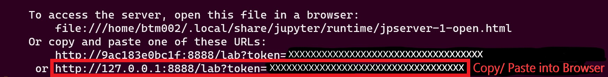
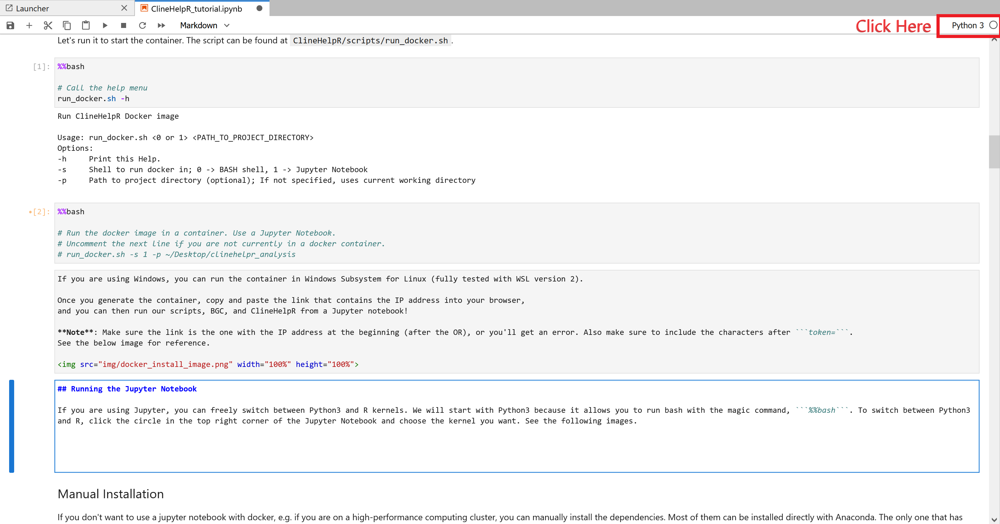
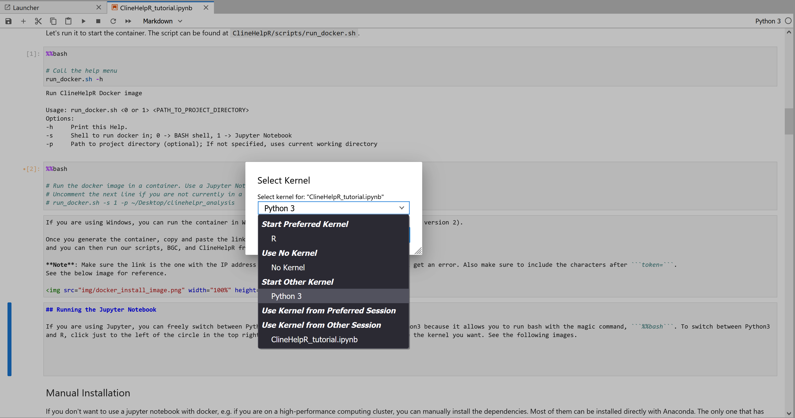

# ClineHelpR

Plot BGC and INTROGRESS genomic cline results and correlate INTROGRESS clines with environmental variables.

ClineHelpR allows you to plot BGC (Bayesian Genomic Cline) output. After we ran BGC, we realized it wasn't easy to plot the BGC results, so we put together this package in the process of figuring it out.

Our package provides tools for running BGC as well as pre- and post-processing its input and output files. The pipeline spans from input file conversion to plotting results, identifies outliers from the BGC output files, and allows you to make numerous highly customizable, publication-quality plots.

ClineHelpR also provides INTROGRESS tools spanning input file conversion and parsing and plotting the results. Finally, ClineHelpR provides tools for performing ecological niche modeling to correlate environmental variables with the INTROGRESS output. 

The BGC and INTROGRESS software packages are described elsewhere (Gompert and Buerkle, 2010, 2011, 2012; Gompert et al., 2012a, 2012b).

## Software Flow Diagram


## Example Dataset

All example data are available from a Dryad Digital Repository (https://doi.org/10.5061/dryad.b2rbnzsc8), as the files are too large for GitHub. To run the example data, download the exampleData directory from DRYAD, then run the R scripts in the ClineHelpR/scripts directory.

**NOTE**: For the tutorials, we will use the example dataset. The current working directory in each tutorial is ```/home/user/app/notebooks```, and we will place the example data in ```"../data/exampleData"```. ```../data``` and ```notebooks``` are volumes that are automatically created for you in the docker container, and they allow you to interface between your host system and the docker container. When you run docker, create a parent directory to keep the input and output, and create subdirectories in it called ```data/```, ```notebooks```, and ```results```. Store the exampleData file in ```data/```, and store your Jupyter Notebooks in ```notebooks```.

## Installation  

There are two options for installing ClineHelpR and its dependencies:

1. With docker
2. Manual installation.

### Docker

ClineHelpR can be run in a container from our pre-built image. The image has all the dependencies installed and is compatible with Python 3.6, BGC, and R. Additionally, the docker container can be run in a Jupyter notebook directly from your browser! However, if you would rather run it in a terminal, we still provide that as an option.

#### Docker Step 1: Pull the Docker Image

First, pull the docker image. 

``` sudo docker pull btmartin721/clinehelpr```

#### Docker Step 2: Run the Image

Once you have the image, then you can run the docker image in a container. If you aren't familiar with docker, it basically runs a pre-built image in a "container", which is like a virtual machine that is isolated from your operating system. In this case, that virtual machine runs Ubuntu 18.04 and has all the necessary dependencies and software pre-installed and in your path.

If you are using Windows, you can run the container in Windows Subsystem for Linux (fully tested with WSL version 2).

Once you generate the container, copy and paste the link that contains the IP address into your browser, 
and you can then run our scripts, BGC, INTROGRESS, ENMeval, and ClineHelpR from a Jupyter notebook!  

We have provided a BASH script to run the docker image in a container. The script has command-line arguments that allow you to choose between running a shell environment or a Jupyter Notebook.

Let's run it to start the container. The script can be found in ```ClineHelpR/scripts/```.

To run it, you can type ```run_docker.sh -h``` to pull up the help menu. It looks like this:

```
# run_docker.sh is in the ClineHelpR/scripts directory.
run_docker.sh -h

Run ClineHelpR Docker image

Usage: run_docker.sh <0 or 1> <PATH_TO_PROJECT_DIRECTORY>
Options:
-h     Print this Help.
-s     Shell to run docker in; 0 -> BASH shell, 1 -> Jupyter Notebook
-p     Path to project directory (optional); If not specified, uses current working directory
```

If you want to run the docker container in a terminal, you can specify:

```run_docker.sh -s 0 -p ./analysis```

If you want to run it in a Jupyter Notebook, run the command like this:

```run_docker.sh -s 1 -p ./analysis```

```-s 0``` tells the docker container to start in a terminal.
```-s 1``` tells it to run the docker container in a Jupyter Notebook. 

Either way, all the necessary dependencies and scripts will be in your path.

If it asks you if your daemon is running, type ```sudo service docker start``` and run the ```run_docker.sh``` script again.  

If you choose to run the Jupyter Notebook, a link that you can copy and paste into your browser will print to the terminal. 

**Note**: Make sure the link is the one with the IP address at the beginning (after the OR), or you'll get an error. Also make sure to include the characters after ```token=```. See the below image for reference.



## Running the Jupyter Notebook

If you are using Jupyter, you can freely switch between Python3 and R kernels. We will start with Python3 because it allows you to run bash with the magic command, ```%%bash```. To switch between Python3 and R, click just to the left of the circle in the top right corner of the Jupyter Notebook and choose the kernel you want. See the following images.

 




### Manual Installation

If you don't want to use a jupyter notebook with docker, e.g. if you are on a high-performance computing cluster, you can manually install the dependencies. Most of them can be installed directly with Anaconda. The only one that has to be installed manually is the "INTROGRESS" R package. Additionally, we include a conda environment file, ```environment.yml```, that contains a blueprint for installing all the necessary conda dependencies.


#### Conda Environment File

You can use it by typing ```conda install --file environment.yml``` into a terminal that has anaconda3 or miniconda3 installed. The ```environment.yml``` file is located in the root ClineHelpR GitHub directory. 

#### Full Manual Installation with Conda

If you would rather install the dependencies manually, they are listed below. To install them, you can run the following commands in a terminal:  

```
conda create -n clinehelpr python=3.6
conda activate clinehelpr
conda install -c conda-forge r-base r-dplyr r-bayestestr r-scales r-reshape2 r-ggplot2 r-forcats r-gtools r-rideogram r-gdata r-adegenet r-enmeval r-rjava r-raster r-sp r-dismo r-ggforce r-concaveman r-readr r-xml r-stringi r-devtools jupyterlab
```

To install the additional pyVCF dependency for the vcf2bgc.py script:

```conda install -c bioconda pyvcf```

In our experience, installing conda packages from conda-forge and bioconda works better with R packages than the default anaconda or r channels. Importantly, we have experienced compatibility issues when trying to install some packages from the r or default conda channels and others from bioconda or conda-forge. We highly recommend using conda-forge and bioconda, which play nicely together.

#### Install R Packages

If you are not using docker, then you also need to install the INTROGRESS R package. Type the following command into your R session:

```install.packages("introgress", dependencies=TRUE, repos="https://cran.r-project.org/")```

#### Installing ClineHelpR

Finally, if you are not using docker, you need to install ClineHelpR. ClineHelpR can be installed directly from GitHub using the devtools R package. Run the following command(s) from an R session:

```
# NOTE: devtools can be installed with conda (recommended)
# However, if you don't already have devtools installed, uncomment the next line
# install.packages("devtools")

# Install ClineHelpR
devtools::install_github("btmartin721/ClineHelpR")
``` 

### Dependencies

ClineHelpR has multiple dependencies, most of which can be installed using Anaconda3. They are all listed below.

The bgcPlotter functions require:

+ data.table
+ dplyr
+ bayestestR
+ scales
+ reshape2
+ ggplot2
+ forcats
+ gtools
+ RIdeogram
+ gdata
+ adegenet
+ ggforce
+ concaveman
+ readr

The environmental functions require:

+ ENMeval
+ rJava
+ raster
+ sp
+ dismo

The INTROGRESS functions require:

+ introgress (not available from conda)
+ ggplot2
+ dplyr
+ scales

Other required dependencies

+ XML (R package)
+ stringi

The vcf2bgc.py script requires:
+ Python >= 3.4 and Python <= 3.6
+ pyVCF

## Pipeline

There are R and python scripts in the ClineHelpR/scripts directory that allow you to run our whole pipeline. All the steps from below can be run by modifying and using those scripts. We also demonstrate each step in our Jupyter Notebook tutorial in the ClineHelpR/tutorials directory.

## References

Gauthier J., de Silva D.L., Gompert Z., Whibley A., Houssin C., Le Poul Y., McClure, M., Lemaitre, C., Legeai, F., Mallet, J., Elias, M. 2020. Contrasting genomic and phenotypic outcomes of hybridization between pairs of mimetic butterfly taxa across a suture zone. Molecular Ecology, 29: 1328–1343.

Gompert Z., Buerkle C.A.. 2009. A powerful regression-based method for admixture mapping of isolation across the genome of hybrids. Molecular Ecology, 18: 1207–1224.

Gompert, Z., Buerkle, C.A. 2010. INTROGRESS: A software package for mapping components of isolation in hybrids. Molecular Ecology Resources, 10(2): 378-384.

Gompert Z., Buerkle C.A. 2012. BGC: Software for Bayesian estimation of genomic clines. Molecular Ecology Resourses, 12: 1168–1176.

Gompert Z., Buerkle C.A. 2011. Bayesian estimation of genomic clines. Molecular Ecology, 20: 2111–2127.

Gompert Z., Lucas L.K., Nice C.C., Fordyce J.A., Forister M.L., Buerkle C.A. 2012. Genomic regions with a history of divergent selection affect fitness of hybrids between two butterfly species. Evolution, 66: 2167–2181.

Gompert Z., Parchman T.L., Buerkle C.A. 2012. Genomics of isolation in hybrids. Philosophical Transactions of the Royal Society B Biological Sciences. 367: 439–450.

Gompert Z., Mandeville E.G., Buerkle CA. 2017. Analysis of population genomic data from hybrid zones. Annual Review of Ecology & Evolution, 48: 207–229.

Hao, Z., Lv, D., Ge, Y., Shi, J., Weijers, D., Yu, G., Chen, J. 2020. RIdeogram: Drawing SVG graphics to visualize and map genome-wide data on the idiograms. PeerJ Computer Science, 6: e251.

Kass, J. M., Muscarella, R., Galante, P. J., Bohl, C. L., Pinilla‐Buitrago, G. E., Boria, R. A., Soley-Guardia, M., Anderson, R. P. 2021. ENMeval 2.0: redesigned for customizable and reproducible modeling of species’ niches and distributions. Methods in Ecology and Evolution, 12: 1602-1608.

Li, H. 2018. Minimap2: Pairwise alignment for nucleotide sequences. Bioinformatics, 34(18): 3094-3100.

Martin, B.T., Douglas, M.R., Chafin, T.K., Placyk, J.S. Jr., Birkhead, R.D., Phillips, C.A., Douglas, M.E. 2020. Contrasting signatures of introgression in North American box turtle (*Terrapene* spp.) contact zones. Molecular Ecology, 29(21): 4186-4202.

Phillips, S.J., Anderson, R.P., Schapire, R.E. 2006. Maximum entropy modeling of species geographic distributions. Ecological Modelling, 190: 231-259.

Phillips, S.J., Dudík, M., Schapire, R.E. 2004. A maximum entropy approach to species distribution modeling. In Proceedings of the Twenty-First International Conference on Machine Learning, pp. 655-662.
